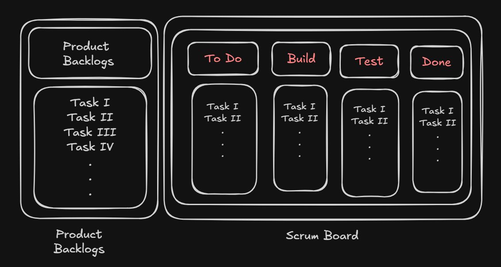

# Software Development Basics

### How software is built?

Software is built through a structured process called the Software Development Life Cycle (SDLC), which transforms a basic idea into a working computer program.

## SDLC

The software development life cycle(SDLC) is a structured process which is being followed during software building.

### Need of SDLC

- To define the role and functionality
- Effectively control expenses and assets
- To develop systematically & maintain scalability
- To describes entry and exit criteria for each phase
- To clear understanding among team representatives
- Boost output, super quality software, reduce danger and VA patchings

### The stages of SDLC are as follows:

- Planning and Requirement Analysis (Business Analysis)
  - Discussion & Brainstorm
- Defining and gathering Requirements (Requirement defining)
  - Define requirements, POA & timeline
  - Evaluate technical and economic feasibility
- Designing the software system (Designing)
  - Architecture Design
  - HLD & LLD (system design)
  - UI Designs
  - UX Designs
  - DB Design
- Developing the software (Coding)
- Testing the developed software (Testing)
- Deployment of the tested software (Devops)
- Maintenance of the deployed software (Application Support)

### SDLC Models [popular four]

- Agile (Used Most effectively)

Agile methodology is a practice which promotes continues interaction of development and testing during the SDLC process of any project. In the Agile method, the entire project is divided into small incremental builds. All of these builds are provided in iterations, and each iteration lasts from one to three weeks.

- Prototype

The prototyping model starts with the requirements gathering. The developer and the user meet and define the purpose of the software, identify the needs, etc.

A 'quick design' is then created. This design focuses on those aspects of the software that will be visible to the user. It then leads to the development of a prototype. The customer then checks the prototype, and any modifications or changes that are needed are made to the prototype.

Looping takes place in this step, and better versions of the prototype are created. These are continuously shown to the user so that any new changes can be updated in the prototype. This process continue until the customer is satisfied with the system. Once a user is satisfied, the prototype is converted to the actual system with all considerations for quality and security.

- Waterfall

The waterfall is a universally accepted SDLC model. In this method, the whole process of software development is divided into various phases.

The waterfall model is a continuous software development model in which development is seen as flowing steadily downwards (like a waterfall) through the steps of requirements analysis, design, implementation, testing (validation), integration, and maintenance.

Linear ordering of activities has some significant consequences. First, to identify the end of a phase and the beginning of the next, some certification techniques have to be employed at the end of each step. Some verification and validation usually do this mean that will ensure that the output of the stage is consistent with its input (which is the output of the previous step), and that the output of the stage is consistent with the overall requirements of the system.

- V - Model

In this type of SDLC model testing and the development, the step is planned in parallel. So, there are verification phases on the side and the validation phase on the other side. V-Model joins by Coding phase.

## STLC

The Software Testing Life Cycle (STLC) is a structured process that defines the steps involved in testing a software product. It ensures that the application meets quality standards and user expectations. An essential part of SDLC, guide QA.

### Phases of STLC

- Requirement Analysis
  - review documents,interview stakeholders, identify the challenges and ambiguities
  - Understand what to test, scope and testing challenges
- Test Planning
  - most crucial, test strategy and plan are created
  - Define testing objectives, scope, and priorities
  - Identify required testing environments, tools, and resources
  - Assign roles and responsibilities to the testing team
- Test Case Development
  - Writing test cases that are clear, concise and easy to understand
  - Creating test data and test scenarios that will be used in the test cases
- Test Environment Setup
  - It defines the hardware, software and network conditions under which testing will be executed.
  - Install and configure required software, tools and databases. Set up servers, browsers, operating systems and devices.
  - Prepare access credentials and permissions. Validate the environment before test execution.
- Test Execution
  - In this phase, the prepared test cases are executed in the defined environment
  - Run manual or automated test cases. Log defects with details like severity and priority.
  - Retest fixed defects (defect retesting). Perform regression testing if required.
  - Collect and analyze test results. Document and share test reports.
- Test Closure
  - The final phase where testing activities are completed and documented
  - Ensure all defects are tracked and closed
  - Clean up the test environment. Archive test cases, data and reports.

## STLC vs SDLC

|    **Aspect**    | **SDLC (Software Development Life Cycle)**                                                                            | **STLC (Software Testing Life Cycle)**                                                                            |
| :--------------: | --------------------------------------------------------------------------------------------------------------------- | ----------------------------------------------------------------------------------------------------------------- |
|  **Definition**  | A process that defines all phases of software development, from requirements gathering to deployment and maintenance. | A process that defines all phases of software testing, from requirement analysis to test closure.                 |
|    **Focus**     | Focuses on building the software.                                                                                     | Focuses on verifying and validating the software.                                                                 |
|    **Phases**    | Requirement gathering, Design, Development, Testing, Deployment, Maintenance.                                         | Requirement analysis, Test planning, Test case development, Test environment setup, Test execution, Test closure. |
| **Performed By** | Developers, business analysts, project managers, QA team (partly).                                                    | QA/testing team primarily.                                                                                        |
| **Deliverables** | Software product, design documents, user manuals, deployment package.                                                 | Test plan, test cases, defect reports, test summary, closure report.                                              |
|  **Objective**   | To deliver a working software product that meets user requirements.                                                   | To ensure the product is defect-free and high quality before release.                                             |
|   **Relation**   | Covers the entire lifecycle of the software.                                                                          | Part of SDLC, focused only on testing.                                                                            |

## Development Methodologies

## Agile Concepts in SDLC

The meaning of Agile is swift or versatile. This method break tasks into smaller iterations, do not directly involve the long term planning. Each iteration is considered as a short time frame called **_sprint_** (SCRUM) in the Agile process model, which typically lasts from one to four weeks.

The division of the entire project into smaller parts helps to minimize the project risk and to reduce the overall project delivery time requirements. Each iteration involves a team working through a full SDLC including **_planning, requirements analysis, design, coding, and testing_** before a working product is demonstrated to the client.

Following is the two popular Agile Techniques :-

- SCRUM
- KANBAN

### SCRUM

SCRUM is an agile development process focused primarily on ways to manage tasks in team-based development conditions. This is more efficient in small teams.

> The term (SCRUM) is borrowed directly from rugby union, where a "scrum" (short for scrummage) is a formation where players tightly pack together to restart play cooperatively.

#### Basic Terminologies

- **_Users Story :_** The documents of the product (BRD - Business Required Documentations)

- **_Acceptance criteria :_** a set of specific conditions that satisfies BRD

- **_Definition of Ready(DoR) :_** Applies before work begins, ensuring input quality for a sprint

- **_Definition of Done (DoD):_** Applies after work finishes, ensuring the output meets quality standards for release.

#### SCRUM Terminologies

- **_Scrum Master :_** Sprint planning and manages the scrum board

- **_Scrum Board :_** Collection of all sprints status

- **_Daily Scrum :_** Daily meeting, 15-20 min for sprint's status

- **_Product Owner :_** One who decides what to build, own the product

- **_Backlog :_** The remaining or left tasks

- **_Product Backlog :_** The remaining tasks from the BRD

- **_Sprint :_** A short time frame to work, mostly 2-4 weeks.

- **_Sprint Planning :_** The plannig of adding tasks in sprint.

- **_Sprint Backlog :_** Prevoius sprint's remaining tasks

- **_Sprint Review :_** Demonstration of the completed tasks to owner

- **_Sprint Retrospective :_** aim to make the next sprint more effective, efficient and reduce sprint's backlogs as per previous sprint

- **_Development Team :_** the actual developers, build products

#### The roles and their responsibilities :-

---

- The **_Scrum Master_** plans the **_sprint_** and manages the **_Scrum Board_**. Add the tasks from the backlogs.

- The Master lead the **_Daily Scrum_** (being joined by the Product Owner and the Development Team), explains the sprints and the backlogs, follow ups the tasks and iterates the development process.

- The **_Developmemt Team_** access the open sprints from the board and initialize the developments and the re-release after its completion.

- **_The sprint ends with :_** sprint backlogs, sprint review and sprint retrospective and the next sprint planning.
